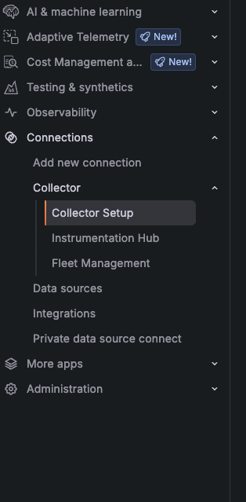
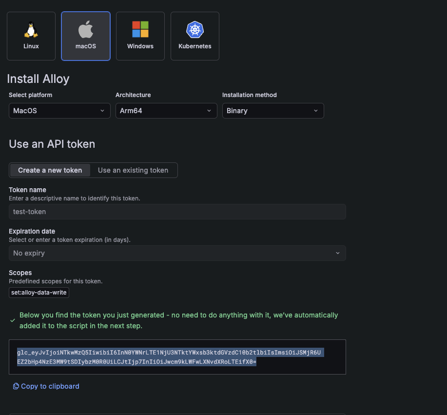
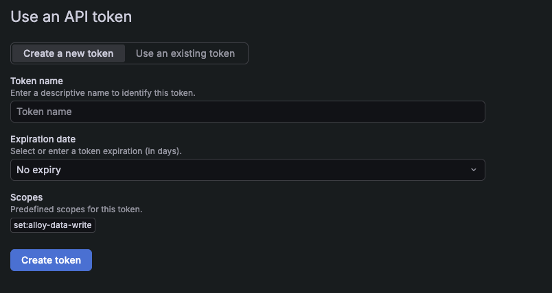
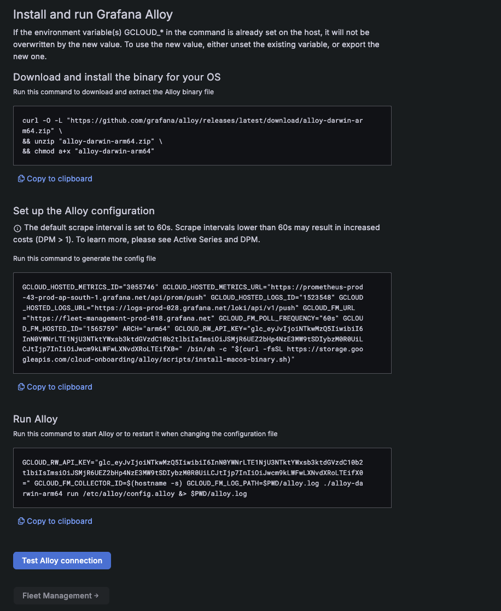
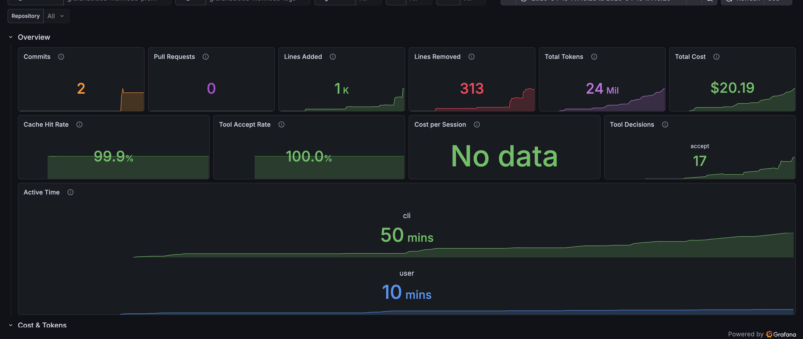
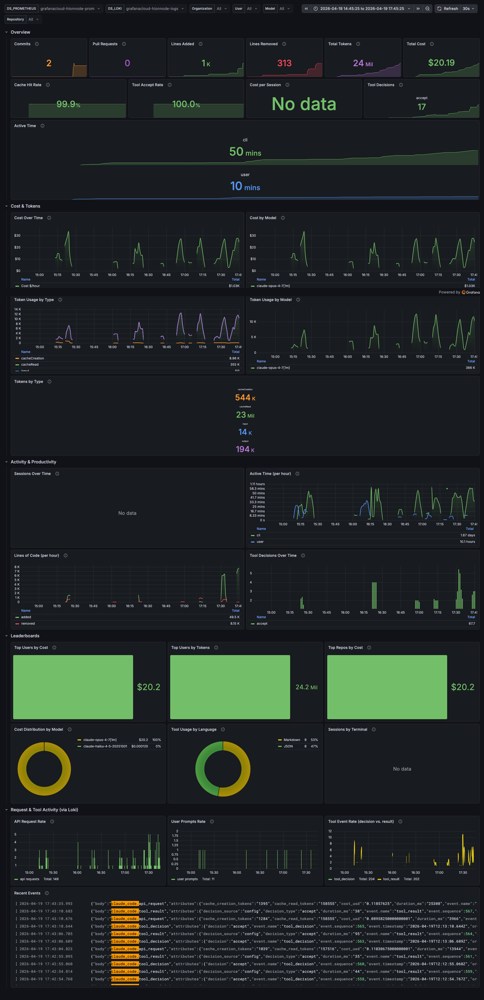
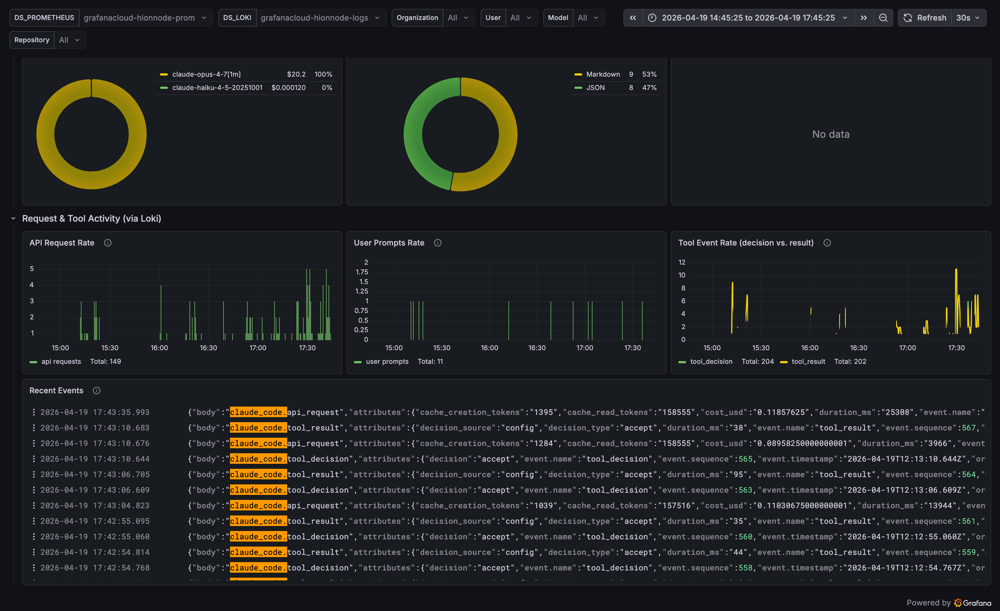

# spawn-claude

A Go CLI for macOS that manages a system-wide [Grafana Alloy](https://grafana.com/docs/alloy/) collector for Claude Code OTLP telemetry. A single `spawn-claude` command both (a) runs `claude` with the OTLP environment variables from the [SignOz Claude Code monitoring guide](https://signoz.io/docs/claude-code-monitoring/) and (b) forwards that telemetry through a local Alloy collector that can be pointed at SignOz, Grafana Cloud, or any other OTLP-compatible backend.

Alloy installs at the standard system paths (`/etc/alloy/config.alloy`, `/usr/local/bin/alloy`, `/Library/LaunchDaemons/com.grafana.alloy.plist`) and runs as a root-owned LaunchDaemon — same layout Homebrew/`.deb`/`.rpm` would give you, so snippets from Grafana and SignOz onboarding UIs paste into the config unchanged. spawn-claude prompts for `sudo` inline whenever it writes those paths.

## Status

Pre-1.0 but feature-complete. Working: collector lifecycle, `spawn-claude run` (local + `--direct`), vendor presets (SignOz Cloud, Grafana Cloud), end-to-end `spawn-claude doctor`, and a goreleaser-driven release pipeline with a `curl | sh` bootstrap installer.

Platform: **macOS on Apple Silicon (darwin/arm64) only.**

## Contents

- [Setup](#setup) — install spawn-claude → set up Alloy via Grafana Cloud's Collector Setup UI → run claude → import dashboard
- [Further reading](#further-reading) — architecture, Alloy cookbook, Grafana Cloud gotchas
- [Commands](#commands)
- [File layout after install](#file-layout-after-install)
- [Why download a prebuilt binary instead of `brew install grafana/grafana/alloy`](#why-download-a-prebuilt-binary-instead-of-brew-install-grafanagrafanaalloy)
- [Uninstall](#uninstall)
- [Roadmap](#roadmap) · [Releasing](#releasing) · [Development](#development) · [License](#license)

## Setup

spawn-claude is a thin wrapper around two pieces macOS already knows how to do: running Grafana Alloy as a LaunchDaemon, and exec'ing `claude` with the right `OTEL_*` env vars. **The Alloy collector is the load-bearing piece** — if Alloy isn't healthy, no telemetry flows anywhere, and `spawn-claude run` becomes an env-var exporter pointed at nothing. The four steps below take you from zero to telemetry landing in a real backend.

### 1. Install spawn-claude

```bash
curl -fsSL https://raw.githubusercontent.com/hionnode/spawn-claude/main/install.sh | sh
```

Downloads the latest GitHub release tarball, verifies its sha256 against the published `checksums.txt`, and drops the binary at `$HOME/.local/bin/spawn-claude`. Override the location with `BIN_DIR=/usr/local/bin sh install.sh`. The release binary is **not Apple-notarized** — the install script strips the quarantine xattr so Gatekeeper doesn't block on first run; full notarization requires a paid Apple Developer account and is intentionally out of scope.

If you have Go 1.23+ and prefer to build from source:

```bash
go install github.com/hionnode/spawn-claude@latest
```

### 2. Set up Alloy via Grafana Cloud's Collector Setup UI

Neither install approach is complete on its own. `spawn-claude collector install` doesn't know your Grafana Cloud hosted URLs or instance IDs — it writes a local-debug default. Grafana's `install-macos-binary.sh` writes a *self-monitoring-only* config with no OTLP receiver, routes metrics through a Prometheus bridge that silently drops Delta-temporality sums (which is every `claude_code_*` counter), and leaves Alloy as a hand-run process that dies on reboot. The flow below lets Grafana own what it's good at (URLs + tokens) and spawn-claude fill the Claude-specific gaps.

**Step 1 — generate the install commands in Grafana's UI.**

In your Grafana Cloud stack, navigate via the left sidebar: **Connections → Collector → Collector Setup**.



On the Collector Setup page, pick the **macOS** tab, then set the three dropdowns: platform `MacOS`, architecture `Arm64`, installation method `Binary`.



Under **Use an API token**, click **Create a new token** — give it a descriptive name (e.g. `alloy-laptop`), set expiry to `No expiry` (fine for a dev laptop), scope `set:alloy-data-write`, then **Create token** and copy the generated `glc_...` value:



Scroll down, toggle **Enable Remote Configuration** on, and Grafana renders three command blocks populated with *your* stack's `GCLOUD_*` values.



**Step 2 — run Grafana's first two commands.** They download the Alloy binary into your CWD and write `/etc/alloy/config.alloy` with your stack's hosted URLs, instance IDs, and RW token baked in. Copy them verbatim from Grafana's UI — the `GCLOUD_*` values are tenant-specific; the snippet below uses placeholders:

```bash
# Grafana's first command — download + unzip + chmod into your CWD.
curl -O -L "https://github.com/grafana/alloy/releases/latest/download/alloy-darwin-arm64.zip" \
  && unzip "alloy-darwin-arm64.zip" \
  && chmod a+x "alloy-darwin-arm64"

# Grafana's second command — writes /etc/alloy/config.alloy. Copy VERBATIM from the UI.
GCLOUD_HOSTED_METRICS_ID="<your-id>" \
GCLOUD_HOSTED_METRICS_URL="https://prometheus-prod-XX-prod-<region>.grafana.net/api/prom/push" \
GCLOUD_HOSTED_LOGS_ID="<your-id>" \
GCLOUD_HOSTED_LOGS_URL="https://logs-prod-XXX.grafana.net/loki/api/v1/push" \
GCLOUD_FM_URL="https://fleet-management-prod-XXX.grafana.net" \
GCLOUD_FM_POLL_FREQUENCY="60s" GCLOUD_FM_HOSTED_ID="<your-id>" ARCH="arm64" \
GCLOUD_RW_API_KEY="glc_..." \
  /bin/sh -c "$(curl -fsSL https://storage.googleapis.com/cloud-onboarding/alloy/scripts/install-macos-binary.sh)"
```

**Skip Grafana's third ("Run Alloy") command for now** — the next step replaces it with a patched config + a proper startup.

**Step 3 — patch in the Claude Code OTLP receiver + Delta→Cumulative fix.** Grafana's config has two gaps for Claude Code telemetry:

1. **No OTLP receiver.** The config is self-monitoring-only — Alloy scrapes itself and ships *those* metrics upstream. There's no `otelcol.receiver.otlp` on `:4318`, so Claude Code's OTLP payloads have nowhere to land.
2. **Delta-temporality silent drop.** Metrics flow through `otelcol.exporter.prometheus` → `prometheus.remote_write`, which silently drops monotonic sums with `AggregationTemporality: Delta` — which is every `claude_code_*` counter. Counters never fail (`samples_failed_total = 0`), they just never appear in Grafana. Root cause: [GRAFANA-CLOUD.md § Delta temporality silently drops metrics](GRAFANA-CLOUD.md#related-gotcha-delta-temporality-silently-drops-metrics).

`add-claude-otlp.sh` (repo root) patches both at once — it adds an `otelcol.receiver.otlp` block on `:4317`/`:4318` plus the `otelcol.processor.deltatocumulative` that converts Delta→Cumulative before the Prom bridge. Idempotent, validates via `alloy fmt`, keeps a `.bak`:

```bash
./add-claude-otlp.sh
```

**Step 4 — start Alloy.** Quickest path: Grafana's third command from the UI. Copy it verbatim (it sets `GCLOUD_RW_API_KEY` inline so `sys.env()` in the config resolves) and run it:

```bash
# Grafana's third command — hand-run Alloy in the background. Does NOT survive reboots.
GCLOUD_RW_API_KEY="glc_..." \
GCLOUD_FM_COLLECTOR_ID=$(hostname -s) \
GCLOUD_FM_LOG_PATH=$PWD/alloy.log \
  ./alloy-darwin-arm64 run /etc/alloy/config.alloy &> $PWD/alloy.log
```

For production — Alloy as a LaunchDaemon that auto-starts and survives reboots — follow [GRAFANA-CLOUD.md § The fix](GRAFANA-CLOUD.md#the-fix) for the full migration, including the `GCLOUD_RW_API_KEY` plist-injection launchd requires (the daemon doesn't inherit your shell env, so `sys.env()` returns empty without this).

**Step 5 — verify.**

```bash
spawn-claude collector status
```

`status` probes both the LaunchDaemon (`launchctl print system/com.grafana.alloy`) and the admin UI (`http://127.0.0.1:12345/-/ready`). In the hand-run flow from Step 4, the LaunchDaemon check will report "not loaded" — that's expected; you haven't migrated yet. The `/-/ready` probe should return 200 once Alloy has finished its 1-2s startup. Proceed to [step 3](#3-run-claude-with-telemetry) once `/-/ready` is healthy.

Configure validation via a data round-trip: run `spawn-claude run -- -p "hello"` (next section) and then, ~30s later, in Grafana Cloud's Explore view, query Prometheus for `count by (__name__) ({__name__=~"claude_code.*"})`. You should see names like `claude_code_token_usage_total`, `claude_code_session_count_total`. If it's empty, `spawn-claude doctor` + `spawn-claude collector logs -f` will tell you where the break is.

Hand-writing a config beyond what `add-claude-otlp.sh` generates? See [ALLOY.md](ALLOY.md) for 5 copy-paste recipes, a component reference, and the full data-flow diagram.

### 3. Run claude with telemetry

```bash
spawn-claude run                              # exec's claude with OTLP env pointed at the local collector
spawn-claude run -- --help                    # anything after -- is forwarded to claude
spawn-claude doctor                           # verify end-to-end (in another terminal)
```

`run` exec's `claude` with these environment variables set:

```
CLAUDE_CODE_ENABLE_TELEMETRY=1
OTEL_METRICS_EXPORTER=otlp
OTEL_LOGS_EXPORTER=otlp
OTEL_EXPORTER_OTLP_PROTOCOL=http/protobuf
OTEL_EXPORTER_OTLP_ENDPOINT=http://127.0.0.1:4318
OTEL_METRIC_EXPORT_INTERVAL=10000
OTEL_LOGS_EXPORT_INTERVAL=5000
OTEL_EXPORTER_OTLP_METRICS_TEMPORALITY_PREFERENCE=cumulative
```

`doctor` checks that `claude` is on PATH, the Alloy binary + LaunchDaemon are healthy, `/-/ready` returns 200, OTLP ports 4317/4318 are listening, and every running `claude` has `CLAUDE_CODE_ENABLE_TELEMETRY=1` in its env. It exits non-zero on any failure and prints a remediation hint for each — run it once after first-time setup and any time data stops showing up in your backend.

Confirm upstream ingestion by tailing `spawn-claude collector logs -f` while claude runs — you'll see either the local-debug dump of every payload, or (once your backend is configured per step 2) export-success / export-failure lines from the vendor exporter.

#### `run --direct` (bypass the local collector)

```bash
spawn-claude collector configure signoz-cloud --set-direct   # also writes config.toml
spawn-claude run --direct -- <claude args>                   # sends OTLP straight to SignOz
```

`--direct` reads `[direct].vendor` from `~/.config/spawn-claude/config.toml` (override with `--vendor=<preset>`), loads the preset's required secrets, and exports the per-vendor OTLP env block before exec'ing `claude`. No local collector is involved — the Alloy LaunchDaemon doesn't even need to be running. Useful for quick one-off debugging against a vendor without committing the collector config.

### 4. Import the dashboard

`grafana.json` (repo root) is a v2-schema dashboard tuned to the metrics + log events Claude Code emits through this Alloy pipeline. Import it once you've seen `claude_code_*` metrics arrive in Grafana Cloud Explore (verification step in §2.5).

In Grafana Cloud: **Dashboards → New → Import**, paste the contents of `grafana.json`, pick `grafanacloud-prom` for `DS_PROMETHEUS` and `grafanacloud-logs` for `DS_LOKI`, **Import**.

**Headline strip — the at-a-glance row.** Six totals (Commits, PRs, Lines+, Lines−, Tokens, Cost) sit above three derived ratios that aren't in the raw metric schema: **Cache Hit Rate** (`cacheRead / (input + cacheRead)`), **Tool Accept Rate** (accept / total decisions), and **Cost per Session**. Cache Hit Rate is the single biggest cost lever — cached input tokens cost ~10% of fresh input. Anything under ~70% is a real signal.



**Full dashboard.** Five rows (Overview / Cost & Tokens / Activity & Productivity / Leaderboards / Request & Tool Activity) covering 30 panels:



**The "Request & Tool Activity (via Loki)" row.** The 8 Prometheus metrics give you counters; Claude Code also emits 4 *log* events (`api_request`, `user_prompt`, `tool_decision`, `tool_result`) with rich attributes (`duration_ms`, `cost_usd`, `success`, `tool_name`, `model`, `prompt_length`...). The bottom row plots their rates and exposes a filterable log stream so you can drill into individual events:



For a deeper-dive metric (e.g. P95 API latency from `api_request.duration_ms`, tool error rate by `tool_name`), use the Recent Events panel to confirm Loki's structured-metadata shape in your stack, then add a panel with `| json | unwrap <attr>`. The four shipped Loki panels use pure log-line regex so they work regardless of how the OTel→Loki bridge serializes attributes.

## Further reading

- **[MANUAL.md](MANUAL.md)** — architecture tour plus the manual bash equivalent of every subcommand. Read this when you want to audit or bypass spawn-claude: "show me what this binary is actually doing under the sudo prompt."
- **[ALLOY.md](ALLOY.md)** — Alloy config cookbook. Five full standalone-config recipes (local-debug, OTLP→Grafana Cloud, OTLP→SignOz, the Prometheus+Loki bridge case, Alloy self-monitoring), a component-by-component reference, the data-flow diagram with every hop, failure modes with PromQL verification queries, and a walkthrough of the Grafana Cloud `install-macos-binary.sh` onboarding script's two bugs. Read this when you need a config the presets don't cover or you're merging spawn-claude with a Grafana-onboarded setup.
- **[GRAFANA-CLOUD.md](GRAFANA-CLOUD.md)** — two specific landmines for Grafana Cloud users: (1) `sys.env("GCLOUD_RW_API_KEY")` returns empty under the LaunchDaemon because launchd doesn't inherit shell env, and (2) Delta-temporality monotonic sums are silently dropped by `otelcol.exporter.prometheus` with zero error output (`samples_failed_total` stays at 0, data just never appears). Required reading if you arrived via Grafana's `install-macos-binary.sh`.

## Commands

| Command | What it does |
|---|---|
| `spawn-claude collector install [--alloy-version vX.Y.Z]` | Download Alloy, install binary + plist, `launchctl bootstrap system`, wait for ready. Idempotent. Prompts for sudo. |
| `spawn-claude collector uninstall [--purge]` | `launchctl bootout system` + remove plist and binary. `--purge` also deletes `/etc/alloy`, `/var/lib/alloy`, and `/var/log/alloy`. Prompts for sudo. |
| `spawn-claude collector status` | Show whether the daemon is loaded + whether the UI is ready. Exits 1 on any failure. |
| `spawn-claude collector restart` | `launchctl kickstart -k system/com.grafana.alloy`, then wait for ready. Prompts for sudo. |
| `spawn-claude collector reload` | Hot-reload the config via `POST /-/reload` (no process restart, no sudo). |
| `spawn-claude collector logs [-f]` | Print `/var/log/alloy/stderr.log`. `-f` follows. |
| `spawn-claude collector configure <preset>` | Render a preset into `/etc/alloy/config.alloy`, `alloy fmt` it, sudo-install atomically, hot-reload. `--list` shows options. `--set-direct` also updates `config.toml`. |
| `spawn-claude run [-- claude-args]` | Exec `claude` with OTLP env vars pointed at the local collector. Flags: `--direct`, `--vendor`, `--skip-ready-check`, `--print-env`. |
| `spawn-claude doctor` | Run end-to-end health checks (claude on PATH, alloy installed, LaunchDaemon running, /-/ready, OTLP ports listening, claude processes have telemetry env). Exits 1 on any failure. |
| `spawn-claude version` | Print the spawn-claude version and the default Alloy version. |

## File layout after install

| What | Path | Owner |
|---|---|---|
| Binary | `/usr/local/bin/alloy` | root:wheel 0755 |
| Config | `/etc/alloy/config.alloy` | root:wheel 0644 |
| Data / WAL | `/var/lib/alloy/data/` | root |
| Logs | `/var/log/alloy/{stdout,stderr}.log` | root:wheel 0644 |
| LaunchDaemon | `/Library/LaunchDaemons/com.grafana.alloy.plist` | root:wheel 0644 |
| UI | http://127.0.0.1:12345 | |
| OTLP (gRPC / HTTP) | 127.0.0.1:4317 / 127.0.0.1:4318 | |

Config and logs are world-readable, so `cat /etc/alloy/config.alloy` and `tail -f /var/log/alloy/stderr.log` work without sudo.

## Why download a prebuilt binary instead of `brew install grafana/grafana/alloy`

The Homebrew formula builds from source. On macOS 14.5 with Command Line Tools 15.3, `go build` fails with:

```
ld: B/BL out of range -148443508 (max +/-128MB) from ...
clang: error: linker command failed with exit code 1
```

Apple's old `ld` in CLT 15.3 can't resolve branch islands for Alloy's ~500 MB Go binary on arm64. Newer CLT (16.x with `ld-prime`) fixes it, but upgrading CLT needs a ~5 GB install and sudo. Tracking issue: [grafana/homebrew-grafana#134](https://github.com/grafana/homebrew-grafana/issues/134). `spawn-claude` sidesteps the problem by fetching the prebuilt `alloy-darwin-arm64.zip` directly from the upstream GitHub release.

## Uninstall

```bash
spawn-claude collector uninstall          # bootout + remove plist and /usr/local/bin/alloy
spawn-claude collector uninstall --purge  # also remove /etc/alloy, /var/lib/alloy, /var/log/alloy
```

## Roadmap

- ~~**PR2** — `spawn-claude run`.~~ ✅ shipped
- ~~**PR3** — Presets, `collector configure`, `run --direct`.~~ ✅ shipped
- ~~**PR4** — `spawn-claude doctor`.~~ ✅ shipped
- ~~**PR5** — goreleaser pipeline and `install.sh` bootstrap.~~ ✅ shipped

## Releasing

Pushing a tag like `v0.1.0` to `main` triggers `.github/workflows/release.yml`, which runs goreleaser and produces a GitHub release with the darwin/arm64 tarball and a `checksums.txt`. The `install.sh` bootstrap resolves the latest release tag and installs from that artifact, so a new release is live as soon as the workflow finishes.

```bash
git tag v0.1.0
git push origin v0.1.0
```

## Development

```bash
go build -o spawn-claude .
go vet ./...
./spawn-claude --help
```

## License

MIT — see [LICENSE](LICENSE).
